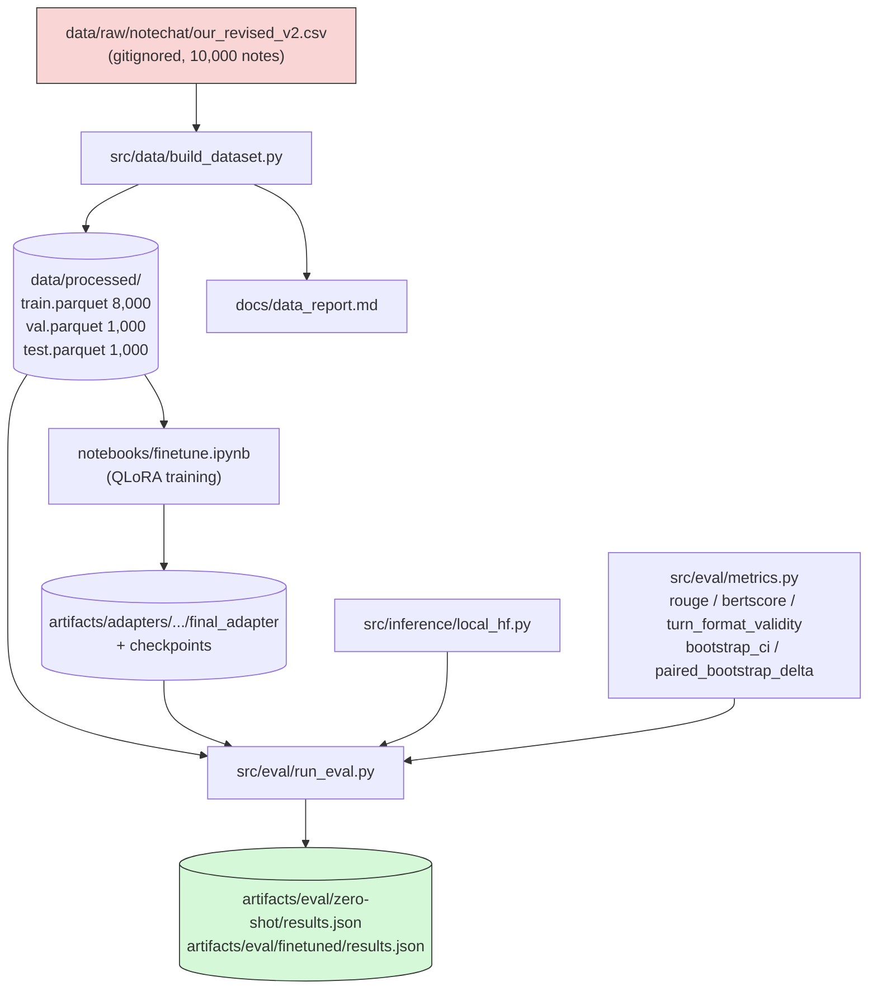

# company-finetune-eval

On-prem QLoRA vs. a larger baseline model, fine-tuned and evaluated on
**clinical note → doctor-patient dialogue generation** (NoteChat). Full
spec: [`docs/PROJECT_SPEC.md`](docs/PROJECT_SPEC.md). Decisions log:
[`docs/DECISIONS.md`](docs/DECISIONS.md). Current status:
[`docs/STATUS_AND_ROADMAP.md`](docs/STATUS_AND_ROADMAP.md).

> Can a small model (Qwen2.5-3B-Instruct), QLoRA fine-tuned on a single
> consumer GPU, match or beat a larger off-the-shelf model at **generating a
> realistic doctor-patient dialogue from a clinical note** — evaluated with
> a harness built as if the underlying data could never leave the local
> machine?

> **Task pivot (2026-08-24):** this project originally targeted CUAD
> contract-clause extraction. The data pipeline and training actually built
> target NoteChat instead — see `docs/DECISIONS.md`'s "Task pivot" entry.

## Status

**Phase 1 (data pipeline) and Phase 5 (QLoRA fine-tune) are done. Phase 2
(eval harness) is built and running its first pass.** Everything else below
is what's left before this reads as a finished project — see
[`docs/STATUS_AND_ROADMAP.md`](docs/STATUS_AND_ROADMAP.md) for the full
ranked list.

| Phase | Status |
|---|---|
| 1 — Data pipeline | Done — 10,000 NoteChat notes → 8,000/1,000/1,000 split by `note_id`, 0 duplicates (`docs/data_report.md`) |
| 2 — Eval harness | Built — `pytest tests/test_eval.py` 12/12; zero-shot + fine-tuned arms running |
| 3 — Contamination probe | Not started |
| 4 — Gold annotation | Skipped, documented (`PROJECT_SPEC.md` §7a item 6) |
| 5 — QLoRA fine-tune | Done — `notebooks/finetune.ipynb`, Qwen2.5-3B-Instruct, LoRA r=16 |
| 6 — Baselines (4 arms) | 2 of 4 wired up (zero-shot + fine-tuned small model) |
| 7 — Write-up | In progress |

## Architecture



**Everything above runs on the local machine only** — no company data is
ever sent to an external API unless `OPEN_DECISIONS` explicitly says
otherwise (`docs/PROJECT_SPEC.md` §1.1).

Repo layout as it exists today:

```
company-finetune-eval/
├── configs/                  # data.yaml, train.yaml, eval.yaml
├── data/                     # gitignored — raw CSV + processed parquet
├── src/
│   ├── data/build_dataset.py    # Phase 1 — pipeline
│   ├── inference/local_hf.py    # shared prompt/gen logic
│   ├── eval/
│   │   ├── metrics.py             # rouge / bertscore / bootstrap CIs
│   │   └── run_eval.py            # single entrypoint, one arm per run
│   ├── train/train.py           # STALE — not yet rewritten to match the notebook
│   └── baselines/                # EMPTY — arm 2 & 4 baselines not built yet
├── notebooks/finetune.ipynb  # the actual Phase 5 training driver
├── artifacts/
│   ├── adapters/.../             # LoRA weights, checkpoints
│   └── eval/{arm}/results.json
├── tests/                     # test_data.py, test_eval.py
└── docs/
    ├── PROJECT_SPEC.md         # full spec
    ├── DECISIONS.md              # running log of every design choice + rationale
    ├── STATUS_AND_ROADMAP.md      # what's done, what's left
    ├── data_report.md
    └── finetune_kernel_setup_status.md
```

See [`docs/ARCHITECTURE.md`](docs/ARCHITECTURE.md) for the original
phase-by-phase design (written before the NoteChat pivot — treat this
README's diagram above as the current one).

## Results

_TBD — populated only by `run_eval.py` output, never hand-written._

| Arm | ROUGE / BERTScore (95% CI) | Turn-format validity | Latency |
|---|---|---|---|
| 1 — Zero-shot small model | TBD | TBD | TBD |
| 2 — Zero-shot large baseline | TBD | TBD | TBD |
| 3 — QLoRA-tuned small model | TBD | TBD | TBD |
| 4 — Classic/non-LLM baseline | TBD | TBD | TBD |

**Caveat:** the `conversation` reference target is itself LLM-generated
(NoteChat's own pipeline), not a human-authored transcript. Any
reference-based metric above measures similarity to one synthetic
exemplar, not correctness against verified ground truth — see
`docs/PROJECT_SPEC.md` §4.2.

## Repro

```bash
uv sync                      # core + dev deps (this machine)
uv sync --extra gpu           # + CUDA training stack (Linux/NVIDIA only)
uv sync --extra llm-large      # + llama.cpp for the large-model baseline

pytest tests/                                  # test_data.py + test_eval.py, 24/24

python -m src.data.build_dataset               # Phase 1 — done, see docs/data_report.md
python -m src.eval.run_eval --arm zero-shot     # Phase 2 — zero-shot small model
python -m src.eval.run_eval --arm finetuned \
    --adapter artifacts/adapters/.../final_adapter  # Phase 2 — QLoRA-tuned small model
```

> **Windows:** `uv sync` (core deps) and `--extra llm-large` work natively.
> `--extra gpu` (Unsloth/bitsandbytes QLoRA training) does not support
> native Windows — run it under WSL2 or on a Linux/NVIDIA machine.

## Data governance

Nothing under `data/` is ever committed. See `docs/PROJECT_SPEC.md` §1.1 and
`.pre-commit-config.yaml`. No company data is ever sent to an external API
unless `OPEN_DECISIONS` explicitly says otherwise. NoteChat's clinical notes
(PMC-Patients case reports) and dialogues are both public research data, not
real confidential company or patient data — see `docs/PROJECT_SPEC.md` §7a
item 3.

## Non-goals

No web UI, no API server, no Docker deployment, no RAG, unless added by
explicit user decision. See `docs/PROJECT_SPEC.md` §8.
