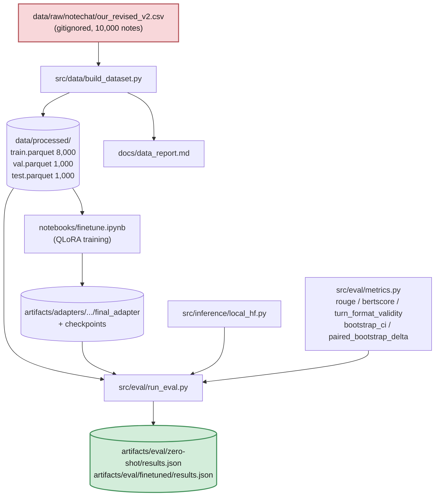

# notechat-qlora-eval

[](https://github.com/Akashkar00/notechat-qlora-eval/actions/workflows/tests.yml)

On-prem QLoRA vs. a larger baseline model, fine-tuned and evaluated on
**clinical note → doctor-patient dialogue generation** (NoteChat). Full
spec: [`docs/PROJECT_SPEC.md`](docs/PROJECT_SPEC.md). Decisions log:
[`docs/DECISIONS.md`](docs/DECISIONS.md). Model card:
[`docs/MODEL_CARD.md`](docs/MODEL_CARD.md). Current status:
[`docs/STATUS_AND_ROADMAP.md`](docs/STATUS_AND_ROADMAP.md).

> Can a small model (Qwen2.5-3B-Instruct), QLoRA fine-tuned on a single
> consumer GPU, match or beat a larger off-the-shelf model at **generating a
> realistic doctor-patient dialogue from a clinical note** — evaluated with
> a harness built as if the underlying data could never leave the local
> machine?

> **Task pivot (2026-08-24):** this project originally targeted CUAD
> contract-clause extraction. The data pipeline and training actually built
> target NoteChat instead — see `docs/DECISIONS.md`'s "Task pivot" entry.

## Status

**All seven phases are complete.** Every arm below was scored on the same 200
held-out records under greedy decoding, and every number in this README is
regenerated from `artifacts/eval/` rather than typed by hand. See
[`docs/STATUS_AND_ROADMAP.md`](docs/STATUS_AND_ROADMAP.md) for what a next
iteration would tackle.

| Phase | Status |
|---|---|
| 1 — Data pipeline | Done — 10,000 NoteChat notes → 8,000/1,000/1,000 split by `note_id`, 0 duplicates (`docs/data_report.md`) |
| 2 — Eval harness | Done — bootstrap CIs, paired deltas, faithfulness proxy, format check; full 200-record run for all four arms |
| 3 — Contamination probe | Done — `src/eval/contamination.py`, prefix-continuation probe with a deranged control (`docs/contamination_report.md`) |
| 4 — Gold annotation | Skipped, documented (`PROJECT_SPEC.md` §7a item 6) — a reasoned skip, not an oversight |
| 5 — QLoRA fine-tune | Done — `notebooks/finetune.ipynb`, Qwen2.5-3B-Instruct, LoRA r=16, 2 epochs / 250 steps |
| 6 — Baselines (4 arms) | Done — zero-shot 3B, zero-shot 14B, QLoRA 3B, and a no-model TF-IDF retrieval baseline |
| 7 — Write-up | Done — this README, `docs/MODEL_CARD.md`, `docs/DECISIONS.md` |

`src/train/train.py` is the CLI equivalent of the notebook that produced the
committed adapter; the adapter itself came from `notebooks/finetune.ipynb`
(`docs/DECISIONS.md`).

## Architecture



**Everything above runs on the local machine only** — no company data is
ever sent to an external API unless `OPEN_DECISIONS` explicitly says
otherwise (`docs/PROJECT_SPEC.md` §1.1).

Repo layout as it exists today:

```
notechat-qlora-eval/
├── configs/                  # data.yaml, train.yaml, eval.yaml
├── data/                     # gitignored — raw CSV + processed parquet
├── src/
│   ├── data/build_dataset.py    # Phase 1 — pipeline
│   ├── inference/local_hf.py    # shared prompt/gen logic (imported by train + eval)
│   ├── eval/
│   │   ├── metrics.py             # rouge / bertscore / bootstrap CIs
│   │   ├── faithfulness.py        # numeric grounding, scored against the note
│   │   ├── run_eval.py            # single entrypoint, one arm per run
│   │   ├── compare.py             # cross-arm paired deltas -> comparison.{json,md}
│   │   └── contamination.py       # Phase 3 memorization probe
│   ├── train/train.py           # Phase 5 CLI trainer
│   └── baselines/classic_baseline.py  # arm 4 — TF-IDF retrieval, no model
├── notebooks/finetune.ipynb  # the training driver that produced the committed adapter
├── artifacts/
│   ├── adapters/.../             # LoRA weights, checkpoints (gitignored)
│   └── eval/{arm}/results.json   # committed — the evidence
├── scripts/run_all_arms.sh   # reproduces every number in this README
├── scripts/try_model.py      # manual probe: one note in, one dialogue out, scored by hand
├── scripts/voice_to_note.py  # voice input for the same pipeline (local STT, no web UI/API)
├── tests/                     # 64 tests — data, metrics, faithfulness, baselines, compare, leak hook
└── docs/
    ├── PROJECT_SPEC.md         # full spec
    ├── DECISIONS.md              # running log of every design choice + rationale
    ├── MODEL_CARD.md              # what the adapter is, and what it must not be used for
    ├── STATUS_AND_ROADMAP.md      # what's done, what's left
    ├── data_report.md
    ├── contamination_report.md
    └── finetune_kernel_setup_status.md
```

See [`docs/ARCHITECTURE.md`](docs/ARCHITECTURE.md) for the phase-by-phase
design: how the metric modules fit together, why `faithfulness.py` scores
against the clinical note rather than the reference, and the contamination
probe's data flow.

## Results

All numbers below are read from `artifacts/eval/*/results.json` and
`artifacts/eval/comparison.json`, produced by `run_eval.py` and
`compare.py` — never hand-written. All four arms scored the **same 200 test
records** under **greedy (deterministic) decoding**, and `compare.py`
verified this before computing any delta, so every comparison below is
paired and reproducible by `bash scripts/run_all_arms.sh`.

### Per-arm (95% percentile bootstrap CI, 1,000 resamples)

| Arm | ROUGE-1 | ROUGE-L | BERTScore-F1 | Numeric grounding recall | Fabricated numbers | Turn-format valid |
|---|---|---|---|---|---|---|
| 1 — Zero-shot Qwen2.5-3B | 0.289 [0.270, 0.307] | 0.149 [0.139, 0.158] | 0.853 [0.851, 0.856] | 0.069 [0.050, 0.091] | 0.026 [0.008, 0.049] | 81.5% |
| 2 — Zero-shot Qwen2.5-14B | 0.442 [0.434, 0.451] | 0.200 [0.195, 0.205] | 0.866 [0.864, 0.868] | 0.058 [0.042, 0.074] | 0.020 [0.004, 0.039] | 100% |
| 3 — QLoRA-tuned Qwen2.5-3B | **0.635 [0.626, 0.644]** | **0.415 [0.403, 0.428]** | **0.910 [0.908, 0.912]** | **0.478 [0.442, 0.513]** | **0.007 [0.000, 0.018]** | **100%** |
| 4 — Classic TF-IDF retrieval (no model) | 0.461 [0.455, 0.468] | 0.219 [0.214, 0.225] | 0.863 [0.861, 0.865] | 0.145 [0.124, 0.166] | **0.699 [0.655, 0.741]** | 99.5% |

### Arm 3 vs. arm 2 — the actual thesis test

A confidence interval on the per-record difference, not two point estimates
eyeballed side by side. This is the comparison the project's headline
question depends on: does the QLoRA-tuned 3B model actually compete with a
model ~4.7× its size?

| Metric | Δ (fine-tuned 3B − zero-shot 14B) | 95% CI |
|---|---|---|
| ROUGE-1 | +0.193 | [+0.181, +0.206] |
| ROUGE-2 | +0.240 | [+0.226, +0.255] |
| ROUGE-L | +0.215 | [+0.201, +0.230] |
| BERTScore-F1 | +0.044 | [+0.041, +0.048] |
| Numeric grounding recall | **+0.420** | [+0.382, +0.459] |
| Fabricated numbers | −0.013 | [−0.035, +0.005] (does **not** exclude zero) |

**Every content metric excludes zero, in favor of the fine-tuned 3B model.**
It doesn't just match the 14B zero-shot model — it beats it on every
reference-similarity metric while using ~4× less VRAM and running faster.
Scaling 3B→14B zero-shot bought +0.153 ROUGE-1 (full pairwise table in
`artifacts/eval/comparison.md`); QLoRA fine-tuning the 3B model bought
+0.346 — more than double the effect of a ~5× parameter increase.

**The numeric-grounding delta is the one result here that isn't just style.**
Fine-tuning didn't only make the model sound more like NoteChat — it
increased how much of the source note's actual numeric content survives
into the dialogue nearly 7-fold (7%→48% recall), a gap far too large to be
sampling noise. The one metric that did **not** move significantly is
fabrication rate itself: both arms fabricate a small, statistically
indistinguishable share of the numbers they do state (~1–2%). So: the
fine-tune got much better at *including* the note's real numbers, not
measurably better at *avoiding invented* ones. Read those as two separate
claims, because the data only supports one of them strongly.

### Arm 4 vs. arm 2 — is a model needed at all?

The skeptical comparison `PROJECT_SPEC.md` §5 Phase 6 requires: a baseline
with **no model, no training, no GPU** against the larger LLM.

| Metric | Δ (TF-IDF retrieval − zero-shot 14B) | 95% CI |
|---|---|---|
| ROUGE-1 | +0.020 | [+0.010, +0.029] |
| ROUGE-L | +0.019 | [+0.013, +0.025] |
| BERTScore-F1 | −0.002 | [−0.005, −0.000] |
| Numeric grounding recall | +0.087 | [+0.063, +0.112] |
| Fabricated numbers | **+0.679** | [+0.633, +0.724] |

**Retrieval significantly outscores the 14B LLM on ROUGE-1** (small effect,
but the CI is entirely positive) **while fabricating 68 percentage points
more of the numbers it states.** A method with no model, no training run,
and no GPU wins the headline metric against a 14B-parameter LLM, because a
retrieved dialogue is fluent, correctly formatted, on-topic — and describes
a different patient. This is direct evidence that ROUGE/BERTScore on this
task substantially reward style- and topic-matching, not faithfulness, and
it is the strongest justification in this repo for building
`faithfulness.py` in the first place. See `docs/contamination_report.md`
and `docs/MODEL_CARD.md` for how this should and shouldn't be read.

### Contamination — did the base model already know this corpus?

NoteChat's notes are public PMC-Patients case reports, so "fine-tuning
improved the scores" could partly mean "fine-tuning surfaced text the model
already had." `src/eval/contamination.py` feeds the **base** model the first
half of 100 held-out dialogues as raw text and measures how close its
continuation lands to the true second half — against a control continuation
from a *different* dialogue, assigned by a derangement so no record is ever
its own control.

| Comparison | ROUGE-L | 95% CI |
|---|---|---|
| Generated vs. **true** continuation | 0.1683 | [0.1627, 0.1736] |
| Generated vs. **random** continuation (control) | 0.1477 | [0.1434, 0.1523] |
| **Δ (true − control)** | **+0.0206** | **[+0.0140, +0.0267]** — excludes zero |

**Detectable but small, and the distinction matters.** The CI excludes zero,
so the memorization signal is real and not sampling noise — this repo does
*not* get to claim the corpus is clean. But it is +0.021 ROUGE-L, a 14% lift
over the generic-style floor, against a fine-tuning effect of +0.215 (arm 3
over arm 2) and +0.266 over the very base model probed here. The
contamination is an order of magnitude too small to account for the result.

Stated precisely: **a small, real contamination signal exists, and it does
not explain the fine-tuning gains.** Full method, threshold, and limitations
in [`docs/contamination_report.md`](docs/contamination_report.md) — including
that prefix continuation only catches *verbatim* recall, so this is a floor
on memorization, not a proof of its absence.

### What these numbers do *not* say

1. **The reference is synthetic.** The `conversation` target is itself
   LLM-generated (NoteChat's own multi-agent pipeline), not a human-authored
   transcript. ROUGE and BERTScore measure *similarity to one synthetic
   exemplar*, not clinical correctness — see `docs/PROJECT_SPEC.md` §4.2.
2. **Most of the ROUGE gain is style-matching; the grounding gain is not.**
   Fine-tuning on 8,000 NoteChat dialogues teaches the model NoteChat's
   house style, turn count, and length distribution — exactly what ROUGE
   rewards, and arm 4's result proves that reward can be earned without any
   understanding at all. The numeric-grounding recall jump is a genuine
   exception: it is a content-level improvement the retrieval baseline
   cannot fake, since it would require actually reading the query note.
3. **Faithfulness here means numeric grounding, not general accuracy.** A
   fabricated diagnosis or finding stated without a number is invisible to
   `faithfulness.py`. Treat "0.7% fabrication rate" as a floor, not a
   certificate — see `docs/MODEL_CARD.md`'s limitations section.
4. **BERTScore here is raw, not baseline-rescaled.** Raw BERTScore has a
   high floor — two unrelated English texts still score ~0.80 — so the
   absolute values above compress into a narrow band and the 0.853→0.910
   gap reads as smaller than it is. Rescaling is a fixed affine shift per
   (model, language), so it cannot change any ranking, sign, or CI
   conclusion here; it is left off deliberately (`src/eval/metrics.py`).
   Read every BERTScore in this README comparatively — "arm 3 above arm 2",
   never "0.910 is 91% correct".

### Cost, not just quality

`unsloth/Qwen2.5-14B-Instruct-bnb-4bit` at `--max-seq-len 2048` fits this
12 GB card at **10.40 GB peak VRAM**, running at **11.5 tok/s**. The
fine-tuned 3B model runs at **16.0 tok/s in 2.41 GB** — so it isn't a
quality-for-cost trade either: it beats the 14B model on every content
metric above while using **~4× less VRAM** and running faster. The TF-IDF
baseline needs no GPU at all and no `tokens_per_second` figure applies to
it (`14.0 records/sec` — retrieval, not generation).

See `docs/DECISIONS.md` for why arm 2 is served through
transformers/bitsandbytes rather than the llama.cpp/GGUF path the spec
originally called for (a network/build-toolchain constraint on this
machine, not a design preference).

> **One caveat on the throughput figures specifically.** The committed
> `tokens_per_second` values were produced before a fix that counts
> generated token ids directly instead of re-tokenizing the decoded string
> (`docs/DECISIONS.md`, 2026-08-28). A full rerun would shift them slightly.
> They were not regenerated because doing so costs ~3.5 GPU-hours to move a
> throughput number; **no quality metric, delta, or CI is affected** — the
> change touches only the token count. Every other number below reproduces
> exactly.

## Repro

**Every number in this README is reproduced by one command:**

```bash
bash scripts/run_all_arms.sh     # all 4 arms + the comparison (~3.5 hrs, 12GB card)
```

Decoding is **greedy**, so a rerun reproduces the numbers exactly rather
than approximately — see "Reproducibility" below. The individual steps:

```bash
uv sync                      # core + dev deps
uv sync --extra gpu --extra voice   # + CUDA stack and/or voice input, as needed
                                      # (pass every extra you want together — `uv sync
                                      # --extra X` alone uninstalls any other extra's packages)

pytest tests/                 # 64 tests: data, metrics, faithfulness, baselines, compare, leak hook
pre-commit install            # data-leak hook + ruff lint/format on every commit

python -m src.data.build_dataset               # Phase 1 — see docs/data_report.md

# Phase 5 — training (or use notebooks/finetune.ipynb)
python -m src.train.train --model-name unsloth/Qwen2.5-3B-Instruct-bnb-4bit

# Phase 6 — one arm per run, results land in artifacts/eval/{arm}/results.json
python -m src.eval.run_eval --arm zero-shot --n-records 200
python -m src.eval.run_eval --arm finetuned --n-records 200 \
    --adapter artifacts/adapters/unsloth__Qwen2.5-3B-Instruct-bnb-4bit/final_adapter

# arm 2 needs the max_seq_len override: configs/train.yaml's 4096 was sized
# for the 3B fine-tune's training context, not a 14B eval (~1.6 hrs / 200 records)
python -m src.eval.run_eval --arm zero-shot-14b --n-records 200 \
    --model-name unsloth/Qwen2.5-14B-Instruct-bnb-4bit --max-seq-len 2048

# arm 4 — no model, no GPU generation (seconds, not hours)
python -m src.eval.run_eval --arm classic-tfidf --n-records 200 --baseline tfidf

# Cross-arm paired deltas -> artifacts/eval/comparison.{json,md}
python -m src.eval.compare

# Phase 3 — contamination probe -> docs/contamination_report.md
python -m src.eval.contamination
```

### Reproducibility

- **Greedy decoding by default.** Sampling would make every score one draw
  from a distribution: reruns would disagree, and `bootstrap_ci` — which
  resamples records as if each score were fixed — would understate the true
  uncertainty. `--sample` opts back in; the choice is recorded in each
  `results.json`, and `compare.py` warns if it is handed a sampled arm.
- **Arms must be scored on identical records.** `compare.py` asserts this
  and refuses to run otherwise, rather than silently intersecting whatever
  overlaps and reporting a confident-looking delta.
- **200 of 1,000 test records**, justified quantitatively in
  `configs/eval.yaml`: CI half-widths are ~25-40x smaller than the effects
  being measured, so scoring all 1,000 would cost 5x the GPU time to change
  no conclusion.

> **Windows:** `uv sync` works natively. `--extra gpu`
> (Unsloth/bitsandbytes QLoRA *training*) does not support native Windows —
> run it under WSL2 or on a Linux/NVIDIA machine. 4-bit *inference* for the
> eval arms does run natively.

## Manual inspection and voice input

`scripts/try_model.py` hands one clinical note to a trained arm and prints
the generated dialogue next to the same numeric-grounding/format checks
`run_eval.py` scores in aggregate — for looking at a single generation by
eye, not for producing a number that belongs in this README (`docs/DECISIONS.md`'s
Phase 5 fabrication finding came from exactly this kind of manual read).

`scripts/voice_to_note.py` adds a voice front end to that same script: it
transcribes an audio file (`--file path.wav`) or a live microphone recording
(`--mic`, stopped by pressing Enter) locally with `faster-whisper`, then
feeds the transcript through the identical `load_model`/`generate`/`report`
path. Requires `uv sync --extra gpu --extra voice` (both extras together —
see the note in Repro above).

```bash
python scripts/try_model.py --from-test random          # a held-out test note
python scripts/voice_to_note.py --mic                    # speak a note instead of typing one
```

No audio or transcript is sent anywhere — transcription runs on-device, same
as everything else in this repo (`docs/PROJECT_SPEC.md` §1.1).

## Data governance

Nothing under `data/` is ever committed. A pre-commit hook
(`scripts/check_data_leak.py`, 10 tests) blocks the top-level data
directories, data-file extensions, the raw NoteChat CSV schema pasted into
any file, and PHI-shaped identifiers (SSN/MRN/NHS/DOB/email) — the shapes
that would matter if this harness were pointed at a real clinical corpus,
which is the constraint it is designed against. See
`docs/PROJECT_SPEC.md` §1.1 and `.pre-commit-config.yaml`. No company data is ever sent to an external API
unless `OPEN_DECISIONS` explicitly says otherwise. NoteChat's clinical notes
(PMC-Patients case reports) and dialogues are both public research data, not
real confidential company or patient data — see `docs/PROJECT_SPEC.md` §7a
item 3.

## Non-goals

No web UI, no API server, no Docker deployment, no RAG, unless added by
explicit user decision. See `docs/PROJECT_SPEC.md` §8.
