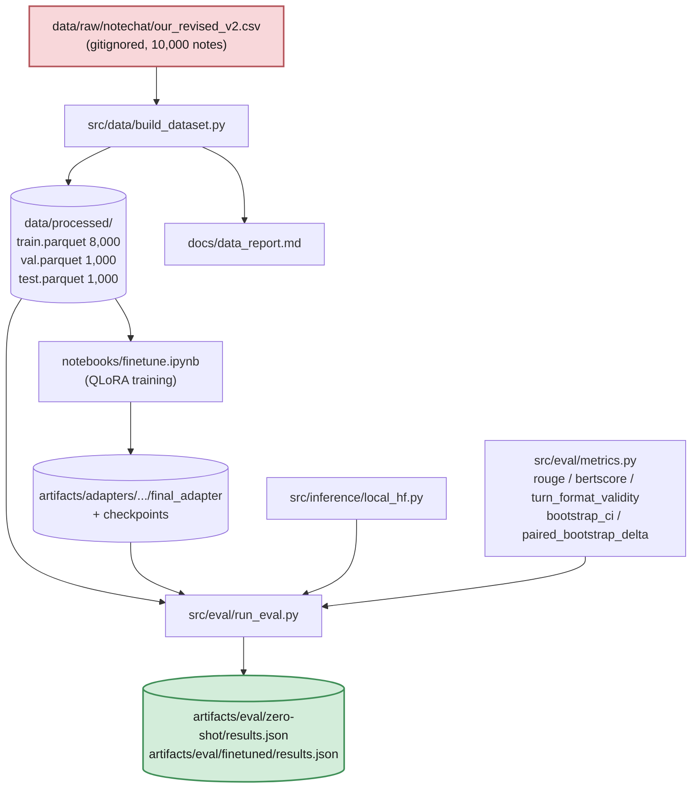

# company-finetune-eval

On-prem QLoRA vs. a larger baseline model, fine-tuned and evaluated on
**clinical note → doctor-patient dialogue generation** (NoteChat). Full
spec: [`docs/PROJECT_SPEC.md`](docs/PROJECT_SPEC.md). Decisions log:
[`docs/DECISIONS.md`](docs/DECISIONS.md). Current status:
[`docs/STATUS_AND_ROADMAP.md`](docs/STATUS_AND_ROADMAP.md).

> Can a small model (Qwen2.5-3B-Instruct), QLoRA fine-tuned on a single
> consumer GPU, match or beat a larger off-the-shelf model at **generating a
> realistic doctor-patient dialogue from a clinical note** — evaluated with
> a harness built as if the underlying data could never leave the local
> machine?

> **Task pivot (2026-08-24):** this project originally targeted CUAD
> contract-clause extraction. The data pipeline and training actually built
> target NoteChat instead — see `docs/DECISIONS.md`'s "Task pivot" entry.

## Status

**Phases 1 (data), 5 (QLoRA fine-tune) and 2 (eval harness) are done, with a
full 200-record result set for three of the four baseline arms.** Arm 4
(classic/non-LLM baseline) and the contamination probe are not built. See
[`docs/STATUS_AND_ROADMAP.md`](docs/STATUS_AND_ROADMAP.md) for the ranked
list of what's left.

| Phase | Status |
|---|---|
| 1 — Data pipeline | Done — 10,000 NoteChat notes → 8,000/1,000/1,000 split by `note_id`, 0 duplicates (`docs/data_report.md`) |
| 2 — Eval harness | Done — `pytest tests/test_eval.py` 12/12; full 200-record run for arms 1, 2, and 3, with bootstrap CIs and paired deltas |
| 3 — Contamination probe | Not started |
| 4 — Gold annotation | Skipped, documented (`PROJECT_SPEC.md` §7a item 6) |
| 5 — QLoRA fine-tune | Done — `notebooks/finetune.ipynb`, Qwen2.5-3B-Instruct, LoRA r=16, 2 epochs / 250 steps |
| 6 — Baselines (4 arms) | 3 of 4 complete (arms 1, 2, 3). Arm 4 (classic/non-LLM) not built |
| 7 — Write-up | In progress |

## Architecture



**Everything above runs on the local machine only** — no company data is
ever sent to an external API unless `OPEN_DECISIONS` explicitly says
otherwise (`docs/PROJECT_SPEC.md` §1.1).

Repo layout as it exists today:

```
company-finetune-eval/
├── configs/                  # data.yaml, train.yaml, eval.yaml
├── data/                     # gitignored — raw CSV + processed parquet
├── src/
│   ├── data/build_dataset.py    # Phase 1 — pipeline
│   ├── inference/local_hf.py    # shared prompt/gen logic
│   ├── eval/
│   │   ├── metrics.py             # rouge / bertscore / bootstrap CIs
│   │   └── run_eval.py            # single entrypoint, one arm per run
│   ├── train/train.py           # STALE — not yet rewritten to match the notebook
│   └── baselines/                # EMPTY — arm 4 baseline not built yet
├── notebooks/finetune.ipynb  # the actual Phase 5 training driver
├── artifacts/
│   ├── adapters/.../             # LoRA weights, checkpoints (gitignored)
│   └── eval/{arm}/results.json   # committed
├── tests/                     # test_data.py, test_eval.py
└── docs/
    ├── PROJECT_SPEC.md         # full spec
    ├── DECISIONS.md              # running log of every design choice + rationale
    ├── STATUS_AND_ROADMAP.md      # what's done, what's left
    ├── data_report.md
    └── finetune_kernel_setup_status.md
```

See [`docs/ARCHITECTURE.md`](docs/ARCHITECTURE.md) for the original
phase-by-phase design (written before the NoteChat pivot — treat this
README's diagram above as the current one).

## Results

All numbers below are read from `artifacts/eval/*/results.json`, produced by
`run_eval.py` — never hand-written. All arms scored the **same 200 test
records** (`--n-records 200 --seed 42`), so every comparison below is paired.

> ⚠️ **These figures are from the superseded stochastic-decoding run and are
> being regenerated.** Evaluation now defaults to greedy decoding so results
> are exactly reproducible (see [Reproducibility](#reproducibility)); the
> table below predates that change and does *not* reproduce under the
> current default. Arm 4 also landed after these were produced. The rerun
> (`bash scripts/run_all_arms.sh`) is in progress — this banner comes down
> when the table is regenerated from it. Flagged rather than silently left
> standing, per `PROJECT_SPEC.md` §1.2.

### Per-arm (95% percentile bootstrap CI, 1,000 resamples)

| Arm | ROUGE-1 | ROUGE-L | BERTScore-F1 | Turn-format validity | Throughput | Peak VRAM |
|---|---|---|---|---|---|---|
| 1 — Zero-shot Qwen2.5-3B (4-bit) | 0.291 [0.273, 0.305] | 0.149 [0.141, 0.156] | 0.852 [0.849, 0.853] | 74.5% | 25.0 tok/s | 2.24 GB |
| 2 — Zero-shot Qwen2.5-14B (4-bit) | 0.445 [0.438, 0.453] | 0.198 [0.194, 0.202] | 0.865 [0.863, 0.867] | 100% | 12.3 tok/s | 10.44 GB |
| 3 — QLoRA-tuned Qwen2.5-3B (4-bit) | **0.631 [0.622, 0.641]** | **0.405 [0.392, 0.419]** | **0.909 [0.906, 0.911]** | **100%** | 17.2 tok/s | 2.42 GB |
| 4 — Classic TF-IDF retrieval (no model) | pending rerun | — | — | — | — | — |

### Arm 3 vs. arm 2 — the actual thesis test

Not two point estimates side by side, but a confidence interval on the
per-record difference (`artifacts/eval/comparison_all_arms.json`). This is
the comparison the project's headline question depends on: does the
QLoRA-tuned 3B model actually compete with a model ~4.7× its size?

| Metric | Δ (fine-tuned 3B − zero-shot 14B) | 95% CI |
|---|---|---|
| ROUGE-1 | +0.186 | [0.174, 0.198] |
| ROUGE-2 | +0.232 | [0.216, 0.248] |
| ROUGE-L | +0.208 | [0.193, 0.223] |
| BERTScore-F1 | +0.043 | [0.040, 0.047] |

**Every interval excludes zero, in favor of the fine-tuned 3B model.** It
doesn't just match the 14B zero-shot model — it beats it, on every metric,
while using ~4× less VRAM and running at higher throughput. Scaling
3B→14B zero-shot bought +0.154 ROUGE-1 (see full pairwise table in
`artifacts/eval/comparison_all_arms.json`); QLoRA fine-tuning the 3B model
bought +0.341 — more than double the effect of a ~5× parameter increase, on
this task and this similarity measure.

### Arm 3 vs. arm 1 — fine-tuning vs. its own zero-shot baseline

| Metric | Δ (fine-tuned − zero-shot 3B) | 95% CI |
|---|---|---|
| ROUGE-1 | +0.341 | [0.321, 0.359] |
| ROUGE-2 | +0.269 | [0.255, 0.285] |
| ROUGE-L | +0.257 | [0.241, 0.272] |
| BERTScore-F1 | +0.057 | [0.054, 0.060] |
| Turn-format validity | 74.5% → 100% | — |

Every interval excludes zero here too. QLoRA fine-tuning moved this model on
this task, and the effect is far larger than sampling noise at n=200.

### What these numbers do *not* say

Three caveats, in descending order of how much they matter:

1. **The reference is synthetic.** The `conversation` target is itself
   LLM-generated (NoteChat's own multi-agent pipeline), not a human-authored
   transcript. ROUGE and BERTScore here measure *similarity to one synthetic
   exemplar*, not clinical correctness — see `docs/PROJECT_SPEC.md` §4.2.
2. **A large part of the gain is style-matching.** Fine-tuning on 8,000
   NoteChat dialogues teaches the model NoteChat's house style, turn count,
   and length distribution — which is exactly what ROUGE rewards. The delta
   above is real, but it is substantially "learned the target corpus's
   surface form," not "learned medicine."
3. **There is no faithfulness metric yet.** A qualitative sanity check during
   Phase 5 caught a fabricated aside with no basis in the source note
   (`docs/DECISIONS.md`). Nothing in the harness currently measures whether
   the fine-tune became a *more fluent* fabricator. This is the top-ranked
   open item.

### Cost, not just quality

`unsloth/Qwen2.5-14B-Instruct-bnb-4bit` at `--max-seq-len 2048` fits this
12 GB card at **10.44 GB peak VRAM**, running at **12.3 tok/s**. The
fine-tuned 3B model runs at **17.2 tok/s in 2.42 GB** — so it isn't a
quality-for-cost trade either: it beats the 14B model on every content
metric above while using **~4× less VRAM** and running **~1.4× faster**.

See `docs/DECISIONS.md` for why arm 2 is served through
transformers/bitsandbytes rather than the llama.cpp/GGUF path the spec
originally called for (a network/build-toolchain constraint on this
machine, not a design preference).

## Repro

**Every number in this README is reproduced by one command:**

```bash
bash scripts/run_all_arms.sh     # all 4 arms + the comparison (~3.5 hrs, 12GB card)
```

Decoding is **greedy**, so a rerun reproduces the numbers exactly rather
than approximately — see "Reproducibility" below. The individual steps:

```bash
uv sync                      # core + dev deps
uv sync --extra gpu           # + CUDA stack for training / 4-bit inference

pytest tests/                 # 51 tests: data, metrics, faithfulness, baselines, compare

python -m src.data.build_dataset               # Phase 1 — see docs/data_report.md

# Phase 5 — training (or use notebooks/finetune.ipynb)
python -m src.train.train --model-name unsloth/Qwen2.5-3B-Instruct-bnb-4bit

# Phase 6 — one arm per run, results land in artifacts/eval/{arm}/results.json
python -m src.eval.run_eval --arm zero-shot --n-records 200
python -m src.eval.run_eval --arm finetuned --n-records 200 \
    --adapter artifacts/adapters/unsloth__Qwen2.5-3B-Instruct-bnb-4bit/final_adapter

# arm 2 needs the max_seq_len override: configs/train.yaml's 4096 was sized
# for the 3B fine-tune's training context, not a 14B eval (~1.6 hrs / 200 records)
python -m src.eval.run_eval --arm zero-shot-14b --n-records 200 \
    --model-name unsloth/Qwen2.5-14B-Instruct-bnb-4bit --max-seq-len 2048

# arm 4 — no model, no GPU generation (seconds, not hours)
python -m src.eval.run_eval --arm classic-tfidf --n-records 200 --baseline tfidf

# Cross-arm paired deltas -> artifacts/eval/comparison.{json,md}
python -m src.eval.compare

# Phase 3 — contamination probe -> docs/contamination_report.md
python -m src.eval.contamination
```

### Reproducibility

- **Greedy decoding by default.** Sampling would make every score one draw
  from a distribution: reruns would disagree, and `bootstrap_ci` — which
  resamples records as if each score were fixed — would understate the true
  uncertainty. `--sample` opts back in; the choice is recorded in each
  `results.json`, and `compare.py` warns if it is handed a sampled arm.
- **Arms must be scored on identical records.** `compare.py` asserts this
  and refuses to run otherwise, rather than silently intersecting whatever
  overlaps and reporting a confident-looking delta.
- **200 of 1,000 test records**, justified quantitatively in
  `configs/eval.yaml`: CI half-widths are ~25-40x smaller than the effects
  being measured, so scoring all 1,000 would cost 5x the GPU time to change
  no conclusion.

> **Windows:** `uv sync` works natively. `--extra gpu`
> (Unsloth/bitsandbytes QLoRA *training*) does not support native Windows —
> run it under WSL2 or on a Linux/NVIDIA machine. 4-bit *inference* for the
> eval arms does run natively.

## Data governance

Nothing under `data/` is ever committed. See `docs/PROJECT_SPEC.md` §1.1 and
`.pre-commit-config.yaml`. No company data is ever sent to an external API
unless `OPEN_DECISIONS` explicitly says otherwise. NoteChat's clinical notes
(PMC-Patients case reports) and dialogues are both public research data, not
real confidential company or patient data — see `docs/PROJECT_SPEC.md` §7a
item 3.

## Non-goals

No web UI, no API server, no Docker deployment, no RAG, unless added by
explicit user decision. See `docs/PROJECT_SPEC.md` §8.
