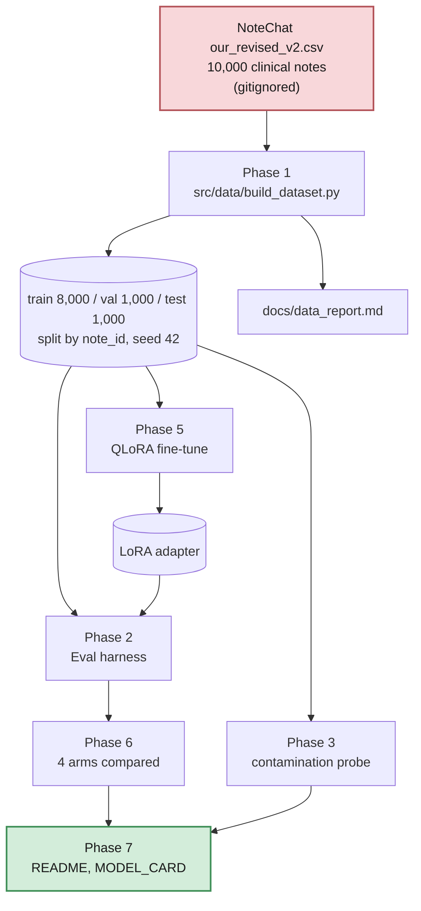
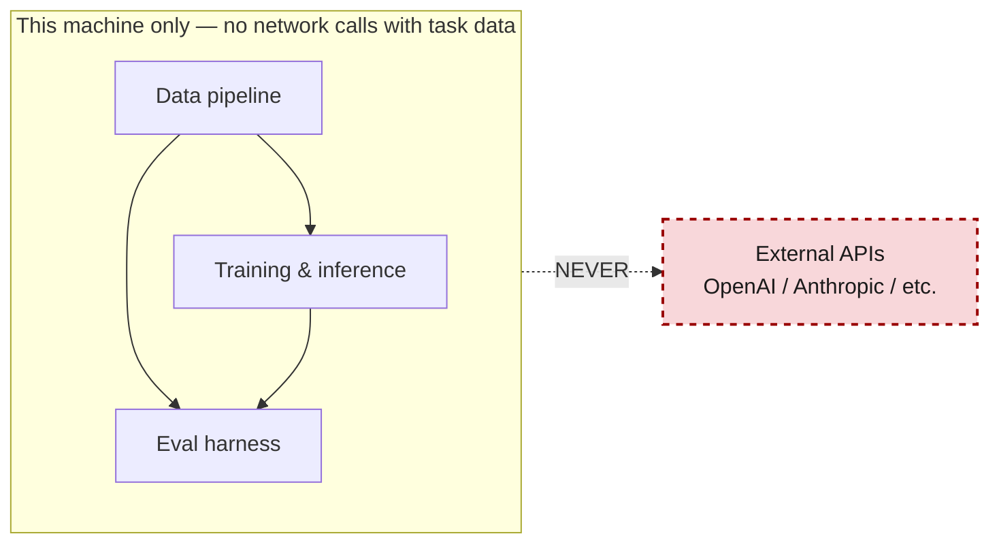
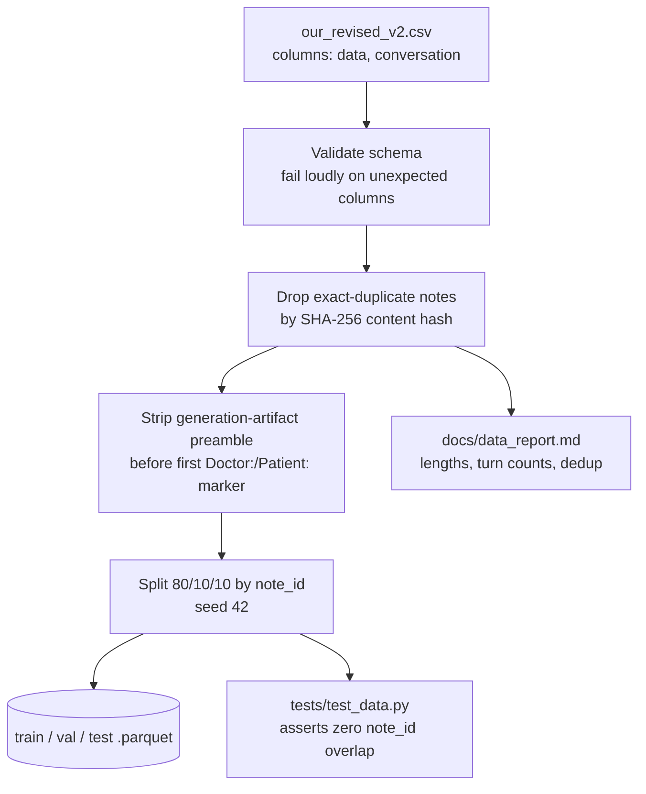
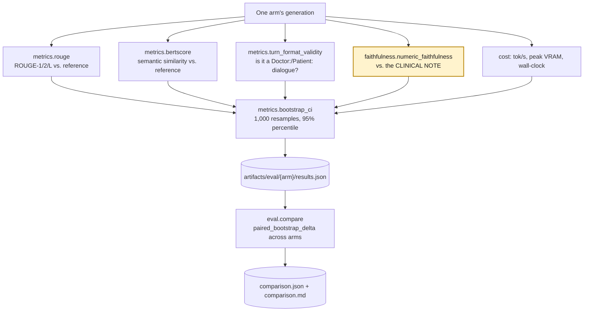
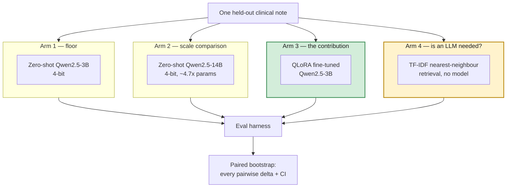
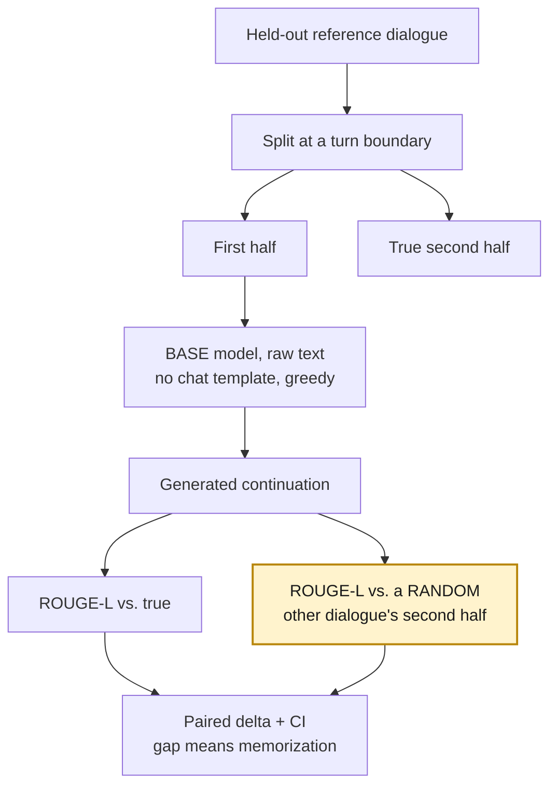

# Architecture — NoteChat clinical dialogue generation

System architecture for the project defined in `PROJECT_SPEC.md`. Rewritten
2026-08-27 for the NoteChat task; earlier revisions of this file described
CUAD contract-clause extraction, which this project pivoted away from on
2026-08-24 (see `DECISIONS.md`, "Task pivot").

The invariant that survived the pivot: **everything runs on the local
machine.** No data, and no derivative of it, is sent to a third-party API
(`PROJECT_SPEC.md` §1.1).

---

## 1. Big picture — how data becomes a result





NoteChat is public research data, so this is a *practised discipline* rather
than a legal requirement for this specific corpus — stated plainly in
`PROJECT_SPEC.md` §7a item 3 so it is never misrepresented as a compliance
finding. The harness is built as though the constraint were real, because
demonstrating that correctly is part of the deliverable.

---

## 2. Phase 1 — Data pipeline



Each row is one unique clinical note, so splitting by row *is* splitting by
source document — simpler than the CUAD case, where one contract carried
many annotation rows and row-level splitting would have leaked.

---

## 3. Phase 2 — Eval harness

The harness is the actual deliverable (`PROJECT_SPEC.md` §0). The model is
evidence that it works.



**Two families of metric, measuring different things.** ROUGE and BERTScore
compare the generation to the *reference dialogue*, which is itself
LLM-generated (§4.2) — they measure similarity to one synthetic exemplar.
`faithfulness.py` (highlighted) instead scores against the *clinical note*,
which is real, and is the only thing in the harness that can detect a fluent
fabrication. Arm 4 exists largely to prove that distinction matters.

`schema.py` and `grounding.py` from the original template were never written:
free-form dialogue has no structured schema to validate and no verbatim
evidence spans to verify (`configs/eval.yaml` records this).

Every metric module is unit-tested against hand-computed examples before it
scores a real model — 46 tests in `tests/`.

---

## 4. Phase 6 — The four arms



All four arms score the **same** 200 test records, and `compare.py` refuses
to run if that stops being true — a paired bootstrap over differently-sampled
arms would still produce a confident-looking number.

**Arm 4 is not a formality.** A retrieval baseline with no model outscores
the zero-shot 14B on ROUGE-1, because a retrieved dialogue is fluent,
correctly formatted, on-topic — and about the wrong patient. It is the
cleanest demonstration in the project that reference-similarity metrics are
not measuring what a reader assumes they measure. See `README.md` Results.

---

## 5. Phase 3 — Contamination probe



The control arm is the whole design. NoteChat dialogues are formulaic, so a
model with zero memorization still scores well above zero against the true
continuation just by writing plausible generic dialogue. Only the *gap*
between true and random is evidence of having seen the text before.

---

## 6. Repo layout

```
company-finetune-eval/
├── configs/              # data.yaml, train.yaml, eval.yaml
├── data/                 # gitignored — raw CSV + processed parquet
├── src/
│   ├── data/build_dataset.py      # Phase 1
│   ├── inference/local_hf.py      # prompts + generation, single source of truth
│   ├── train/train.py             # Phase 5 CLI (imports prompts from local_hf)
│   ├── baselines/classic_baseline.py  # Phase 6 arm 4
│   └── eval/
│       ├── metrics.py             # ROUGE / BERTScore / format / bootstrap
│       ├── faithfulness.py        # numeric grounding vs. the note
│       ├── contamination.py       # Phase 3
│       ├── run_eval.py            # one arm per run
│       └── compare.py             # cross-arm paired deltas
├── scripts/run_all_arms.sh   # reproduces every published number
├── notebooks/finetune.ipynb  # the training run actually used for Phase 5
├── artifacts/
│   ├── adapters/             # LoRA weights (gitignored — large)
│   └── eval/                 # results.json per arm + comparison (committed)
├── tests/                    # 46 tests: data, metrics, baselines, compare
└── docs/
```

---

## 7. What this deliberately does NOT include

- No web UI, API server, or Docker deployment — this is a measurement
  project, judged on rigor rather than deployment surface (`PROJECT_SPEC.md`
  §8).
- No RAG. Note that arm 4 *is* retrieval, but as a baseline to argue
  against, not as a serving architecture.
- No LLM-as-judge metric: grading one model's output with another model
  would reintroduce the synthetic-reference problem §4.2 exists to flag.
- No cloud inference of any kind on task data.
