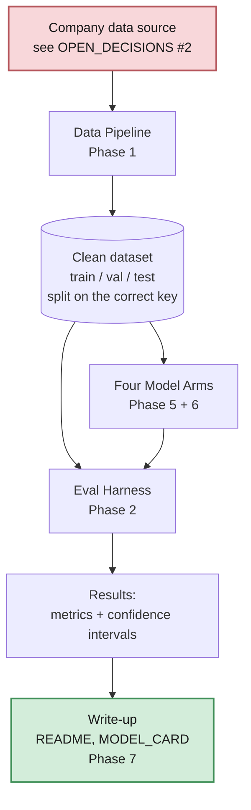
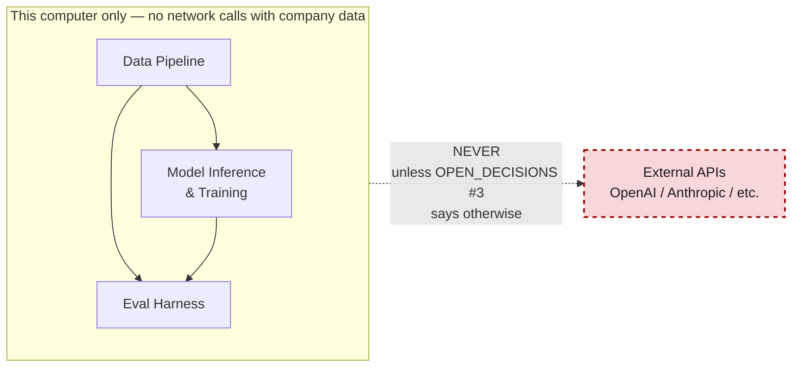
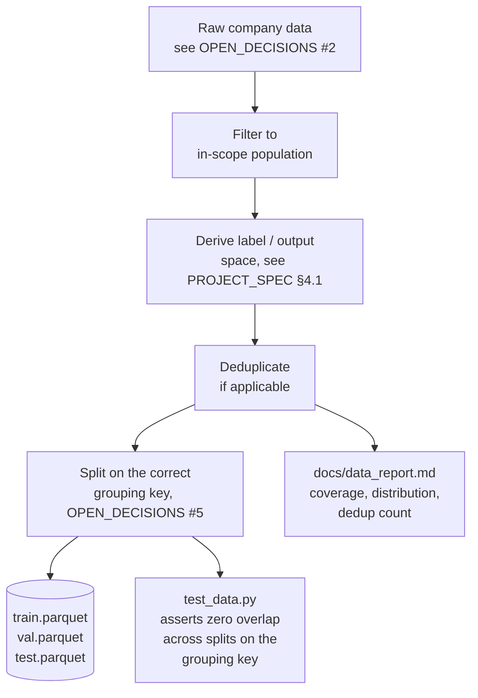
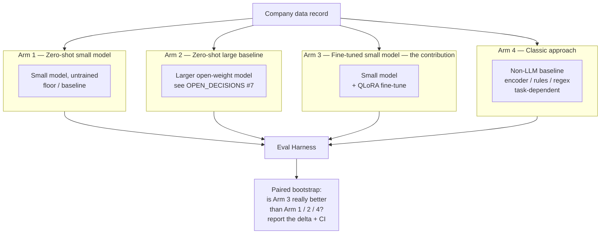

# Architecture — On-Prem Fine-Tuning on Company Data

Full system architecture for the project defined in `PROJECT_SPEC.md`. This
document is a placeholder cloned from `clinical-coding-eval`'s
`ARCHITECTURE.md` — rewrite the diagrams below once `OPEN_DECISIONS` in
`PROJECT_SPEC.md` is filled in and the task is concrete. The one part that
should survive unchanged regardless of task: **everything stays local**
unless `OPEN_DECISIONS` #3 explicitly permits otherwise.

---

## 1. Big picture — how data becomes a result



**Everything inside the dashed boundary below runs on the local machine
only, unless `OPEN_DECISIONS` #3 explicitly permits an external API for a
named, non-sensitive subset of the data.**



---

## 2. Phase 1 — Data pipeline (placeholder, task-dependent)



**Why splitting on the right key matters:** if the same grouping unit
(customer, document source, whatever `OPEN_DECISIONS` #5 names) appears in
both train and test, the model can cheat by memorizing that unit instead of
learning the task.

---

## 3. Phase 2 — Evaluation harness (built and tested *before* any model runs)

```mermaid
flowchart TD
    IN[Model output] --> M1[schema.py\nvalid structured output?\nif applicable]
    IN --> M2[grounding.py\nis any evidence/citation\nverifiable? if applicable]
    IN --> M3[metrics.py\ntask metric(s)\n+ bootstrap confidence intervals]
    IN --> M4[cost / latency\ntokens per second,\nVRAM used, time per record]

    M1 & M2 & M3 & M4 --> OUT[run_eval.py\none combined results.json\nper model arm]
```

Each metric module has its own unit tests, checked against hand-computed
examples first, so the scoring code is trusted before it ever touches a
real model.

---

## 4. Phase 5 & 6 — The four things being compared



**The honest possible outcomes, all of which are valid findings:**
- Arm 3 (fine-tuned small model) matches or beats Arm 2 (large model) → the
  thesis holds.
- Arm 4 (classic approach) beats everything → "the right tool for this task
  isn't a generative LLM at all," reported prominently, not buried.

---

## 5. Code / repo layout

```
company-finetune-eval/
├── configs/                 # YAML configs: data, training, eval
├── src/
│   ├── data/                 # Phase 1 — pipeline
│   ├── train/                 # Phase 5 — QLoRA fine-tuning
│   ├── inference/             # Runs any of the 4 arms locally
│   ├── baselines/              # Arm 4 — classic approach
│   └── eval/                    # Phase 2 — the harness (section 3 above)
├── annotation/                  # Phase 4 — guidelines, sampling, kappa (if needed)
├── tests/                        # pytest — leakage + metric unit tests
└── docs/
    ├── DECISIONS.md               # running log: what was chosen and why
    ├── data_report.md
    ├── contamination_report.md
    ├── annotation_report.md
    └── MODEL_CARD.md
```

---

## 6. What this architecture deliberately does NOT include

- No web UI, no API server, no Docker deployment — this is a
  research/measurement project, not a product.
- No RAG, no external retrieval, unless the task genuinely requires it and
  `OPEN_DECISIONS` says so.
- No cloud inference of any kind on sensitive company data, unless
  `OPEN_DECISIONS` #3 explicitly permits it for a named subset.
