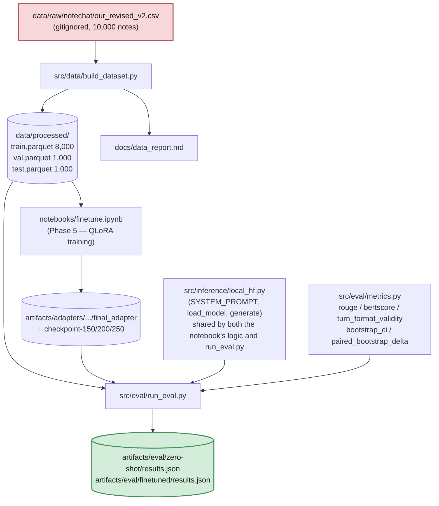

# Status & Roadmap — as of 2026-08-25

Snapshot of what's actually built, the real (current) architecture, and
what's still needed before this reads as a finished, CV-worthy project
rather than "ran a fine-tune notebook once." Companion to `PROJECT_SPEC.md`
(the spec) and `DECISIONS.md` (the why) — this file is the "where things
stand" view, and will go stale fast; treat it as a snapshot, not a live doc.

---

## 1. What's actually done

| Phase | Status | Evidence |
|---|---|---|
| Task selection + spec | Done, pivoted once | `PROJECT_SPEC.md` §7a — NoteChat clinical-note → dialogue generation, superseding an earlier CUAD spec (`DECISIONS.md` "Task pivot") |
| Phase 1 — Data pipeline | **Done** | `src/data/build_dataset.py`; 10,000 NoteChat notes → 8,000/1,000/1,000 split by `note_id`, seed 42, 0 duplicates; `docs/data_report.md`; `pytest tests/test_data.py` 12/12 |
| Phase 2 — Eval harness | **Done** | `src/eval/metrics.py`, `src/eval/run_eval.py`, `src/inference/local_hf.py`; `pytest tests/test_eval.py` 12/12; full 200-record runs for arms 1, 2, and 3 with bootstrap CIs and paired deltas — see `README.md` Results |
| Phase 3 — Contamination probe | **Not started** | No `src/eval/contamination.py`, no `docs/contamination_report.md`. Required per spec — NoteChat's source notes (PMC-Patients) are public, so a foundation model may have seen them in pretraining |
| Phase 4 — Gold annotation | Skipped, documented | `PROJECT_SPEC.md` §7a item 6 — reasoned skip (LLM-generated reference, human "gold" dialogue wouldn't fix that), not an oversight |
| Phase 5 — QLoRA fine-tune | **Done** | `notebooks/finetune.ipynb`; Qwen2.5-3B-Instruct-bnb-4bit, LoRA r=16, 2 epochs / 250 steps; adapter at `artifacts/adapters/.../final_adapter`; sanity-checked qualitatively (`DECISIONS.md`) |
| Phase 6 — Baselines (4 arms) | **3 of 4 done** | Arm 1 (zero-shot 3B), arm 2 (zero-shot 14B, via bnb-4bit — see `DECISIONS.md` for the llama.cpp→transformers pivot), and arm 3 (fine-tuned 3B) all have full 200-record results. **Headline finding: fine-tuned 3B beats zero-shot 14B on every metric, all 95% CIs excluding zero.** Arm 4 (classic/non-LLM) doesn't exist yet — `src/baselines/` is still an empty `__init__.py` |
| Phase 7 — Write-up | **In progress** | `README.md` rewritten for NoteChat with the real results table and paired comparisons. No `docs/MODEL_CARD.md` yet |
| Git history | **3 commits, pushed** | `github.com/Akashkar00/notechat-qlora-eval`, public |

Known small open items already tracked in `DECISIONS.md`: `src/train/train.py`
(CLI trainer) is still CUAD-shaped and hasn't been rewritten to match the
notebook; the epoch-2 `eval_loss` is missing from `trainer_state.json`
(not yet investigated); a hallucination/faithfulness check was found needed
during the sanity-check pass but isn't implemented as a metric yet; the
paired-delta comparison across arms is computed by an ad-hoc script, not a
committed `src/eval/compare.py` CLI entrypoint.

---

## 2. Architecture — what's real today

This supersedes `docs/ARCHITECTURE.md`, which is still the CUAD-era
placeholder (task boxes say "clause extraction," not dialogue generation) —
noted as a gap in §3 below rather than fixed silently here.



**Repo layout, as it exists right now (not the aspirational Phase-7 tree):**

```
company-finetune-eval/
├── configs/
│   ├── data.yaml            # Phase 1 config — NoteChat source, split key
│   ├── train.yaml           # Phase 5 config — QLoRA hyperparams
│   └── eval.yaml            # Phase 2 config — bootstrap settings, val_records
├── data/                    # gitignored — raw CSV + processed parquet
├── src/
│   ├── data/build_dataset.py
│   ├── inference/local_hf.py    # NEW this phase — shared prompt/gen logic
│   ├── eval/
│   │   ├── metrics.py            # NEW this phase
│   │   └── run_eval.py           # NEW this phase
│   ├── train/train.py       # STALE — still CUAD-shaped, not yet rewritten
│   └── baselines/            # EMPTY — Phase 6 arms 2 & 4 not built
├── notebooks/finetune.ipynb # the actual Phase 5 training driver
├── artifacts/
│   ├── adapters/.../         # LoRA weights, checkpoints
│   └── eval/{arm}/results.json
├── tests/
│   ├── test_data.py          # 12/12
│   └── test_eval.py          # 12/12, NEW this phase
└── docs/
    ├── PROJECT_SPEC.md        # current (rewritten for NoteChat)
    ├── DECISIONS.md            # current, running log
    ├── PLAN.md                  # current
    ├── ARCHITECTURE.md           # STALE — CUAD-era placeholder
    ├── data_report.md             # current
    └── finetune_kernel_setup_status.md  # current
```

---

## 3. What's needed for this to read as a finished, CV-level project

Ranked by how much it changes what a reviewer (interviewer, recruiter,
GitHub visitor) actually sees, not by build effort.

### Table stakes — without these, the repo actively misrepresents itself
1. **Commit the work.** Zero commits on `master` right now — anyone looking
   at this repo's history sees nothing. This is the single highest-leverage
   fix: a clean, incremental commit history *is* part of what a CV-level
   project demonstrates (that the phase-gated process in `PLAN.md` was
   actually followed, not invented after the fact).
2. **Rewrite `README.md`.** It currently describes the CUAD task, has a
   results table for the wrong arms, and repro commands that reference
   `python src/eval/run_eval.py` (should be `python -m src.eval.run_eval
   --arm ...` now that it takes CLI args). This is the first (often only)
   file anyone reads — it's currently actively wrong, not just incomplete.
3. **Rewrite `docs/ARCHITECTURE.md`.** Same problem as the README: diagrams
   still say "clause extraction," `OPEN_DECISIONS #2/#7` placeholders never
   got filled in. Section 2 above is the real version; port it in.

### Finish the harness's own job
4. **Let the current eval run finish and report real numbers** (in
   progress) — zero-shot vs. fine-tuned, ROUGE/BERTScore with bootstrap
   CIs, tokens/sec, peak VRAM.
5. ~~**Paired bootstrap delta between arms.**~~ **Done** — computed across
   all three completed arms (`artifacts/eval/comparison_all_arms.json`,
   `README.md` Results). Still ad-hoc (a one-off script, not a committed
   `src/eval/compare.py` entrypoint) — worth formalizing so it's
   reproducible from the command line like everything else.
6. **Hallucination/faithfulness check.** Flagged as a real finding during
   the qualitative sanity check (a fabricated aside with no basis in the
   source note) but never turned into a metric. Even a simple heuristic
   (e.g. numeric/named-entity presence check between note and generation)
   would close a currently-known gap rather than leave it as a footnote.

### The comparison the thesis actually depends on
7. ~~**Phase 6 arm 2 — zero-shot large baseline.**~~ **Done.** Result: the
   fine-tuned 3B model beats the zero-shot 14B model on every metric, all
   95% CIs excluding zero (`README.md` Results) — the project's headline
   finding now has actual evidence behind it, not just the small model
   compared to itself.
8. **Phase 6 arm 4 — classic/non-LLM baseline.** Now the only baseline arm
   left. Currently `src/baselines/`
   is empty. Per the spec this is a legitimate, valuable arm even (especially)
   if it loses — "an LLM wasn't needed" is a real finding for this task
   shape, but there's no evidence either way yet.
9. **Phase 3 — contamination probe.** Explicitly required by the spec
   (NoteChat's source notes are public PMC-Patients case reports), not yet
   started. Skipping it silently would undercut the harness's own claim to
   rigor.

### Polish that reads well in an interview
10. **Ablations** (LoRA rank 8/16/32, 1 vs. 2 epochs) — `PLAN.md`/spec call
    these out explicitly as "interview talking points." Currently only the
    single default config has been run once.
11. **`docs/MODEL_CARD.md`** — doesn't exist yet. Intended use, out-of-scope
    use, training data description, eval results, contamination findings,
    the label-noise caveat (§4.2) — all in the spec's required shape,
    nothing written yet.
12. **Resolve the missing epoch-2 `eval_loss`** (`DECISIONS.md`'s Phase 5
    entry) before it's cited anywhere — right now it's an open question,
    not a documented answer either way.
13. **`src/train/train.py` rewrite** to match the notebook (`DECISIONS.md`'s
    long-standing "still open" item) — a CLI-reproducible trainer, not just
    a notebook, is what makes "training run reproducible from a config
    file" (the Phase 5 acceptance test) actually true rather than aspirational.

### Not needed
Per `PROJECT_SPEC.md` §8: no web UI, no API server, no Docker, no RAG. Adding
any of these would work against the project's own framing ("judged on
measurement rigor, not deployment surface area") rather than strengthen it
for a CV — resist the urge to bolt on a demo UI as a substitute for finishing
items 1–9 above.
